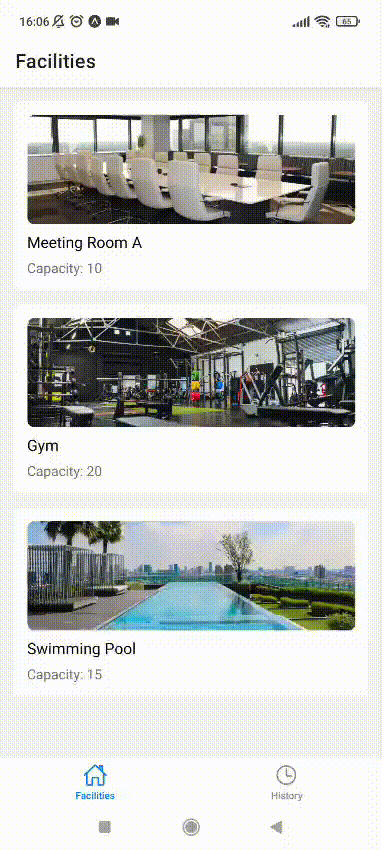

# Facility Book App


A mobile application for booking facilities, built with **React Native**, **Expo**, and **Tailwind CSS (NativeWind)**.  
This app allows users to view available facilities, make bookings, and track their booking history.

---

## Features

- **Facility List**: View all available facilities with details such as name, capacity, and image.
- **Facility Booking**: Make a new booking for a selected facility.
- **Booking Details**: View booking information and edit it if needed.
- **Booking History**: View a list of previous bookings.
- **State Management**: Uses React Context to manage booking state globally.

---

## Libraries / Tools

- **React Native** – The main framework for building the mobile app.
- **Expo** – Simplifies development and testing.
- **NativeWind** – Tailwind CSS support for styling React Native components.
- **TypeScript** – Provides type safety and autocompletion.
- **React Navigation** – Handles navigation between screens.
- **React Context** – For global state management.

---

## Setup / Installation

### Prerequisites

- Node.js >= 20
- Yarn or npm
- Expo CLI (`npm install -g expo-cli`)

### Installation

```bash
git clone https://github.com/firmann19/facility-booking-app.git
cd facility-book-app
yarn install
Running the App
bash
npx expo star
Scan the QR code using Expo Go on your mobile device, or

Run on an emulator/simulator (iOS / Android).

Demo


